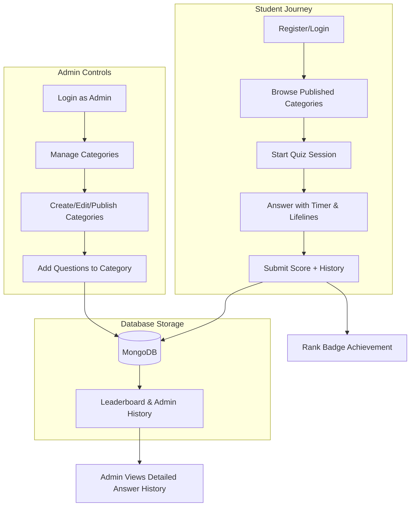

# 🎓 QuizMaster: Full System Documentation (Easy Guide)

This guide explains how your Quiz Platform works behind the scenes, from the database and coding logic to the final user experience.

---

## �️ 1. System Flow Diagram (The "Draw.io" Style)

This flowchart shows how data moves through the system.

---

## 📂 2. Folder Roadmap (What is where?)

### 🏗️ Backend (The Engine)
*   **`server.js`**: The main entry point. It turns on the server and connects the routes.
*   **`model/`**: The "Blueprint" files. They tell the database what information to save (e.g., `Score.js` stores points and question history).
*   **`controller/`**: The "Brains." This is where the actual logic happens (e.g., calculating stats).
*   **`routes/`**: The "Doors." These are the URLs the Frontend uses to send or get data.

### 🎨 Frontend (The Face)
*   **`App.jsx`**: The "Captain." It decides which page to show and who is allowed to see it (Guard system).
*   **`layouts/`**: The "Frames." These provide the persistent left sidebar you see as an Admin or Student.
*   **`pages/Quiz.jsx`**: The "Game Engine." This is the most complex file where the timer and points live.

---

## � 3. Simple Code Logic (Line-by-Line "Easy Mode")

### How the Quiz calculates points (`Quiz.jsx`):
When you click an answer, the code does this:
1.  **Check if Correct**: `if (isCorrect)` — Starts with **10 points**.
2.  **Speed Bonus**: `if (timeLeft > 20)` — If you answer faster than 10 seconds, adds **+5 bonus**.
3.  **Streak**: `const newStreak = streak + 1` — Counts how many you got right in a row.
4.  **Multiplier**: 
    *   3-win streak? `multiplier = 2` (Points x 2)
    *   6-win streak? `multiplier = 3` (Points x 3)
5.  **Final Math**: `pointsToAdd * multiplier` — Multiplies the total and adds it to your score.

### How Admins see your history:
1.  **Saving Data**: When the quiz ends, the frontend sends a list of every question and your answers (`history`) to the backend.
2.  **Retrieving Data**: The Admin **History** page (`Leaderboard.jsx` in admin folder) fetches these scores.
3.  **Expansion**: When the admin clicks a row, it opens a sub-menu that loops through that `history` list to show "User Answered: X | Correct Answer: Y".

---

## 🏆 4. Features Cheat-Sheet

| Feature | How it works | Icon Symbol |
| :--- | :--- | :--- |
| **Draft Mode** | Categories are hidden until Admin clicks "Published". | 👁️ Eye Icon |
| **50/50 Lifeline** | Removes 2 random wrong answers. | ⚡ Zap Icon |
| **Hint Lifeline** | Shows the text added in the "Hint" field by the Admin. | 💡 Bulb Icon |
| **Perfect Bonus** | Get 100% correct? Earn **+50 extra points**. | ✨ Check Icon |
| **Ranking** | Titles like "Genius" are given automatically based on score. | 🎖️ Medal Icon |

---

## 🛠️ 5. Mini-Tutorial for Admins

### Adding a new Topic:
1.  Click **Categories** in the left sidebar.
2.  Click **"New Category"** and type a name (e.g., "AI Basics").
3.  Click the **"Draft"** button to turn it into **"Published"** (It must be green!).
4.  Click the blue **"Questions"** button on that row.
5.  Add at least 5-10 questions. Make sure one is marked as correct!

### Checking Student Answers:
1.  Click **History** in the left sidebar.
2.  Find the student's name.
3.  Click the row to expand it. You will see every question they saw and what they picked!
